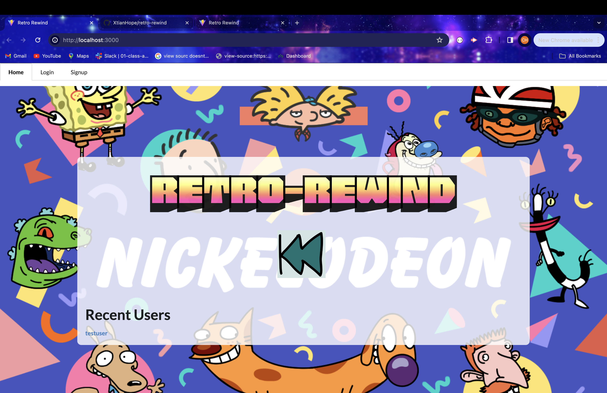
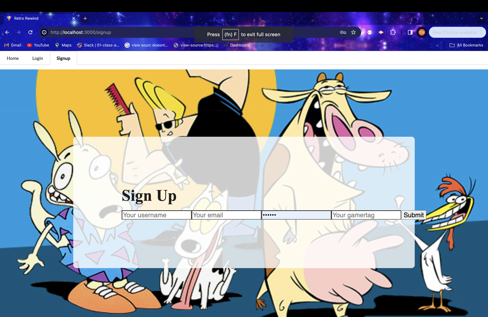
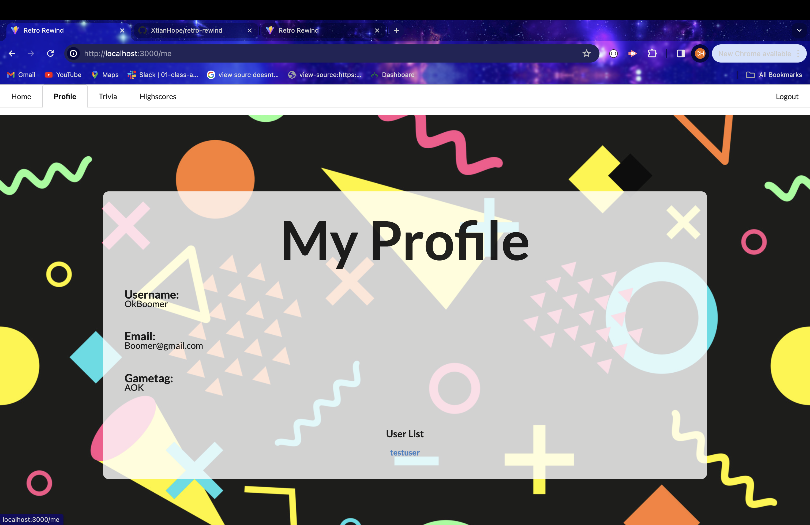
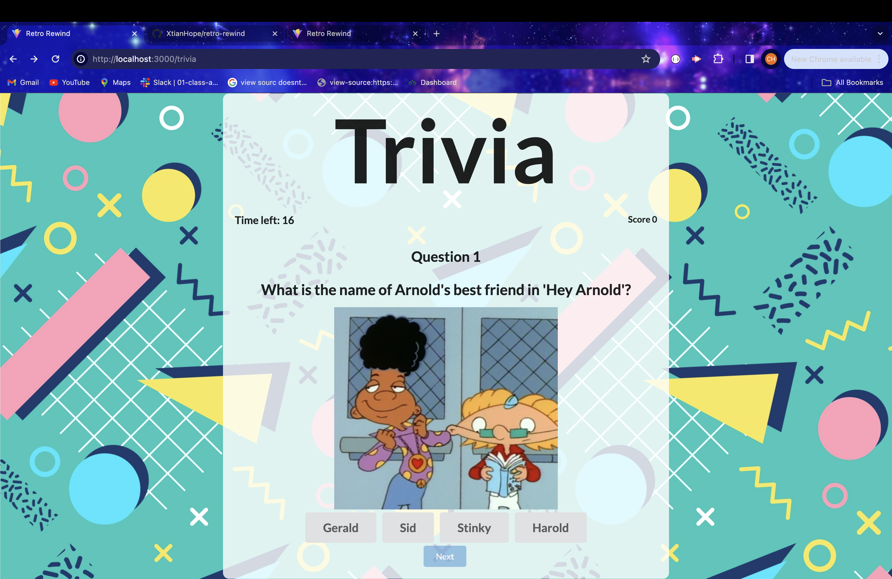
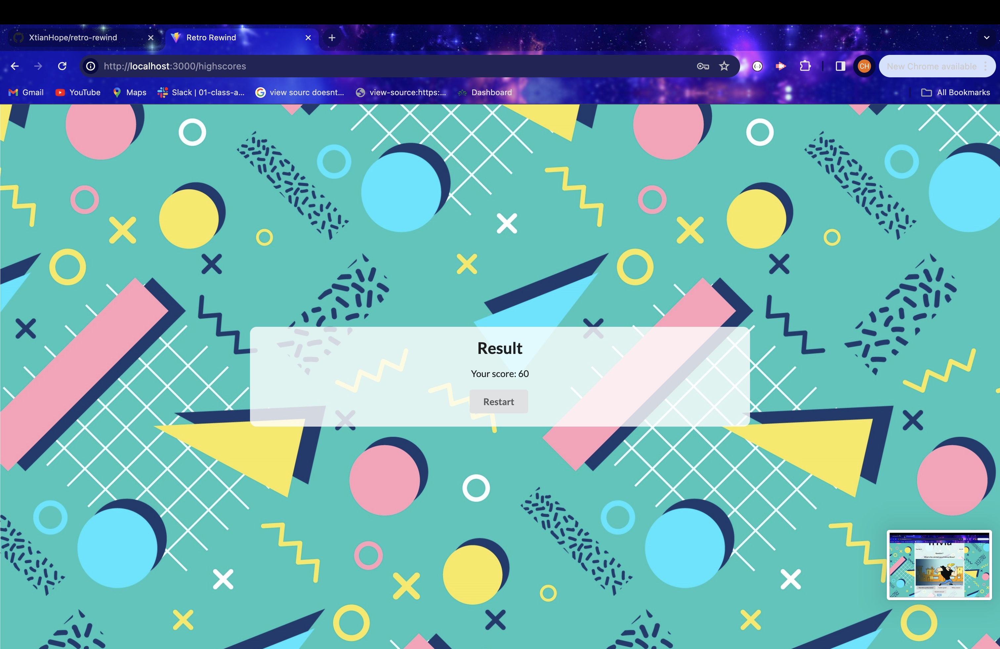

### Retro-Rewind 
# A totally awesome 1990's trivia game

Created by UNCC Coding Bootcamp cohort Team 4

Project Team Members: Christian Tino, Tavario Braswell, Erick Guerroro Illanez and Carol Gray
____________

Retro-Rewind is an interactive MERN-stack single-page application that lets the users test their knowledge of Cartoon trivia from the 1990's. The application utilizes a scalable MongoDB back end, a GraphQL API, and Express.js and Node.js servers with a React front end. Colorful graphics greet the users and invite them to answer questions in a multiple choice format within a set timeframe, while a timer counts down to zero.  The user's score is displayed at the end of the set time. 

User authentication on the sign-in page lets game players save their user info and post scores on the high score page. 

Retro-rewind is deployed on Render. See links below.

- - - -
Render-deployed app: https://

GitHub repository: https://github.com/XtianHope/retro-rewind

## Technologies

### Backend
- MongoDB/Mongoose
- Express.js
- Node.js

### Frontend
- JavaScript
- React
- HTML
- CSS

### Tools
- GraphQL
- Render

### How You Can Get Started With This Project ###

<strong>To use the app:</strong> 

Visit the Render link above. 

Click on the "Sign Up" button in the nav bar and go to the registration form to set up an account. Enter a username and password (at least 6 characters).

This form has validation, so the username must be unique and the password must be at least 6 characters and the two password fields must match.

If you already have already signed up with the retro-rewind app, then click on "Log In" button in the navbar, and in the form enter your username and password. 

If the credentials are not entered correctly for an existing username or password or a user has not registered before this session, the form shows an error message.

Once registered and/or logged in, the profile page opens. On the profile page, you will see a welcome with your username, email and gamer tag.

Now that you are signed in, click on "Trivia" in the Navbar to start the game!

When time runs out after you test your knowledge of 1990's excellent trivia, your score will appear!

Play again as often as you want!

